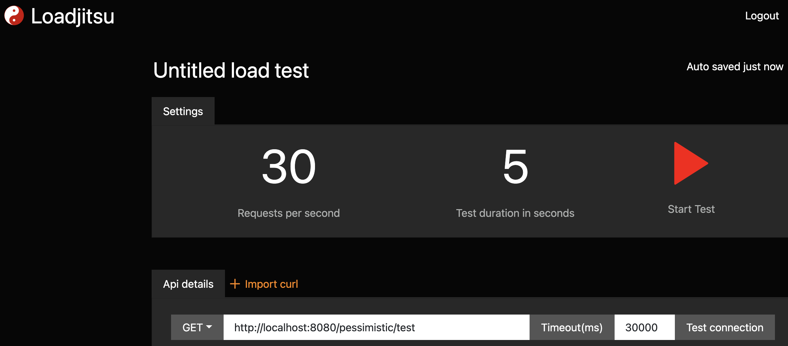
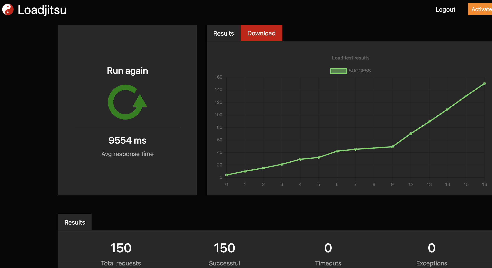
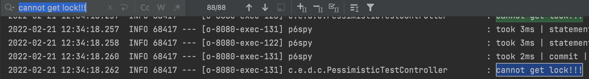
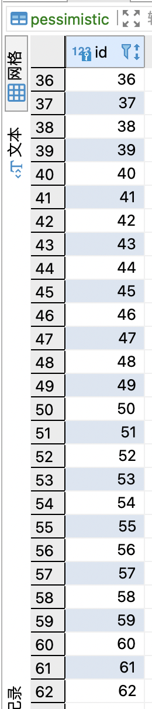
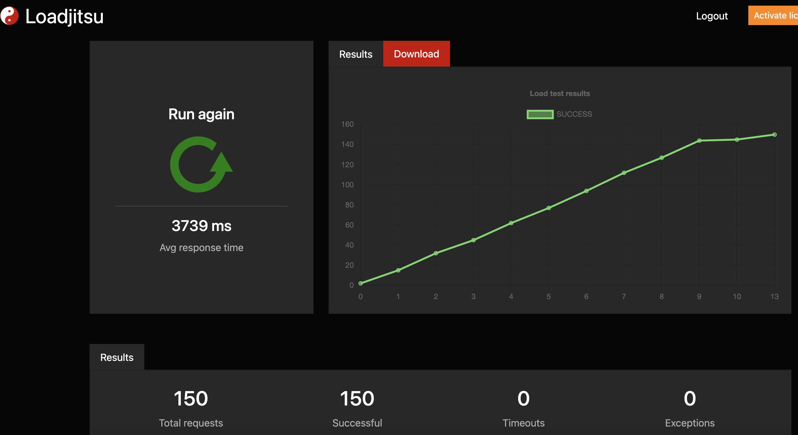
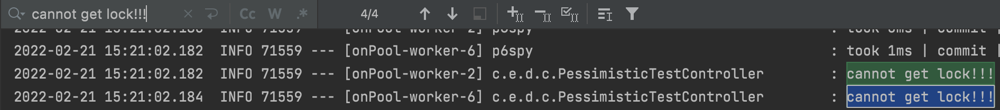
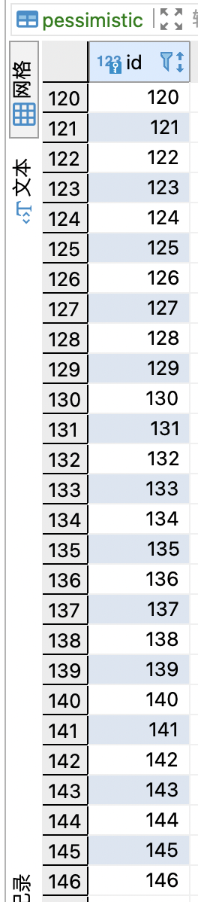

# pessimistic-self-definition-pk

It was inspired by DATABASECHANGELOGLOCK table of Liquibase.

## issue

self-definition PK (numeric) increment

## how

- A request get the lock.
  - others retry or finally cannot get lock!!!
- The request is the only one executor of inserting.
- Release lock.

default isolation level: **REPEATABLE-READ**

### test

30 requests / 1 second => 5s 150 requests  

  
150 requests success, 9.x second avg time  

  
88 cannot get lock!!!  

  
150 - 88 = 62 insert rows  

---

### DeferredResult

150 requests success, 3.x second avg time  

  
4 cannot get lock!!!  

  
150 - 4 = 146 insert rows  
